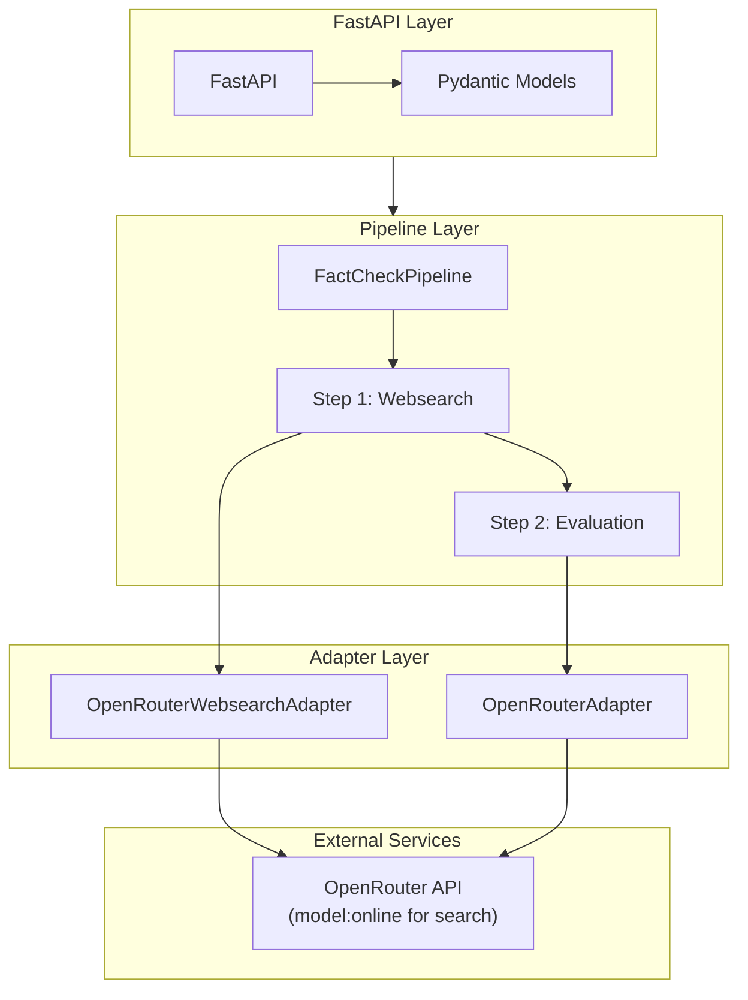
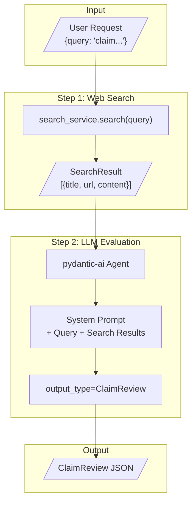
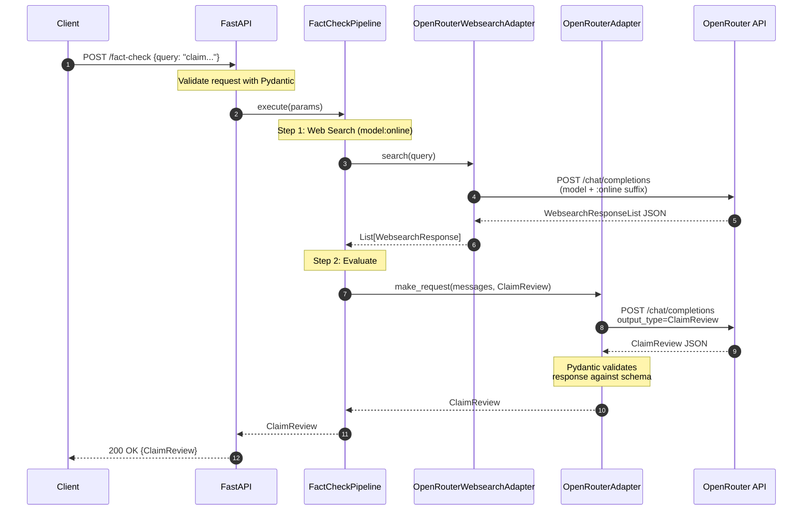
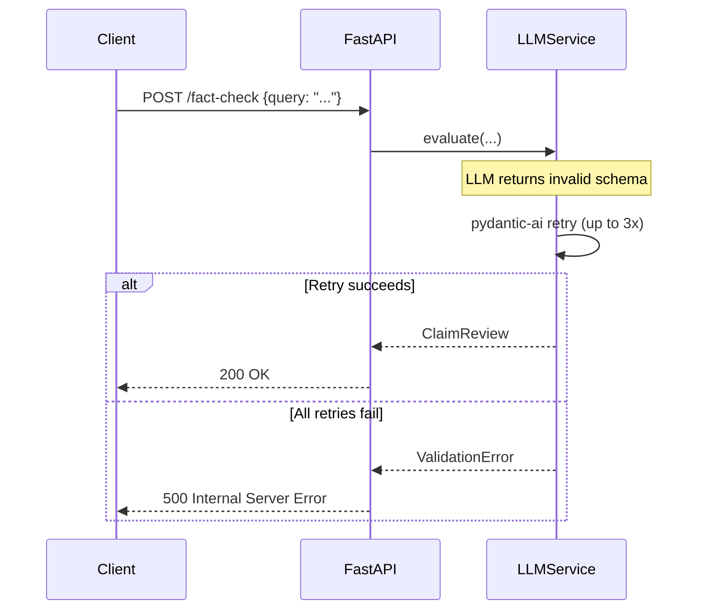
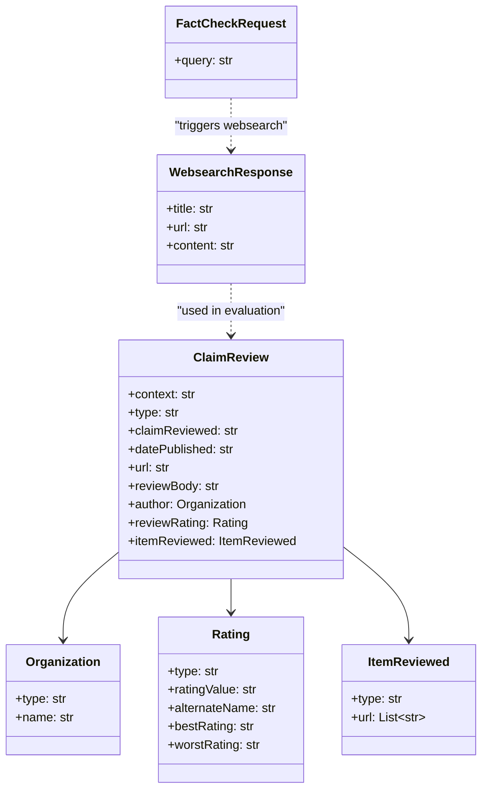
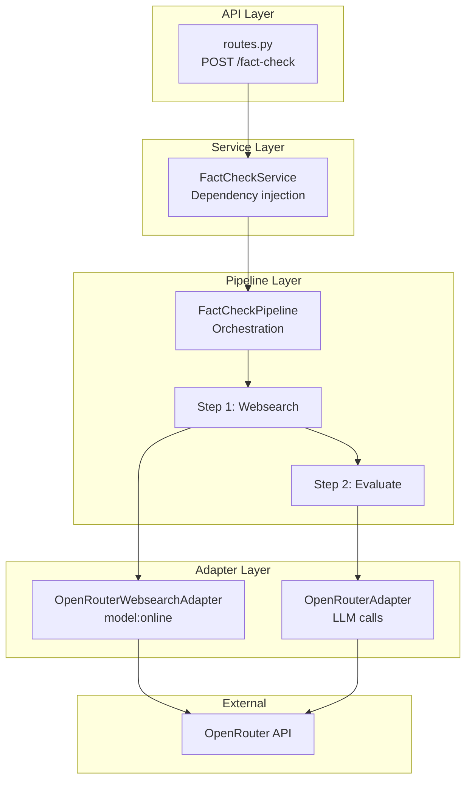
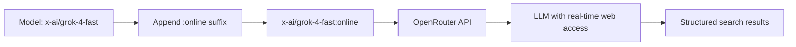
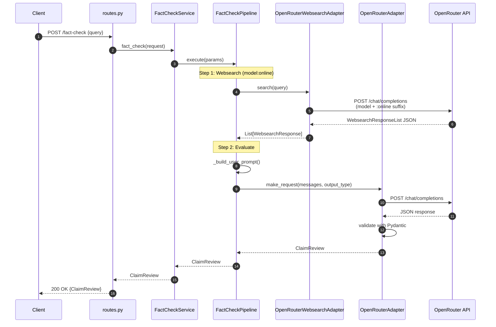

# FastAPI Fact-Check Service Architecture

Architecture document for porting the Azure ML PromptFlow fact-checker to FastAPI + Docker.

---

## Table of Contents

1. [Overview](#overview)
2. [Technology Stack](#technology-stack)
3. [Pipeline Architecture](#pipeline-architecture)
4. [Sequence Diagram](#sequence-diagram)
5. [Pydantic Models](#pydantic-models)
6. [System Prompt Mapping](#system-prompt-mapping)
7. [Project Structure](#project-structure)
8. [API Specification](#api-specification)
9. [pydantic-ai Integration](#pydantic-ai-integration)
10. [Pipeline Pattern (seo-acg Style)](#pipeline-pattern-seo-acg-style)
11. [Configuration](#configuration)

---

## Overview

A **2-step LLM pipeline** (not an agent) that:
1. Searches for evidence (direct API call)
2. Evaluates claim and outputs structured ClaimReview JSON


### Why Pipeline Over Agent?

| Aspect | Agent | Pipeline (Our Choice) |
|--------|-------|----------------------|
| Flow | LLM decides next step | Deterministic sequence |
| Speed | Slower (decision loops) | Faster (direct execution) |
| Tokens | Unpredictable | Controlled |
| Debugging | Complex | Simple |

---

## Technology Stack



| Component | Technology | Purpose |
|-----------|------------|---------|
| API Framework | FastAPI | HTTP endpoints, validation |
| Structured Output | pydantic-ai | LLM calls with typed responses |
| Models | Pydantic BaseModel | Request/Response schemas |
| LLM Provider | OpenRouter | Access to multiple models |
| Web Search | OpenRouter `:online` suffix | Built-in websearch via model suffix |
| Container | Docker + docker-compose | Deployment |

---

## Pipeline Architecture

### High-Level Flow



### Pipeline Steps

| Step | Input | Action | Output |
|------|-------|--------|--------|
| 1 | `query` (string) | Call web search API directly | `List[SearchResult]` |
| 2 | `query` + `search_results` | pydantic-ai Agent with `output_type=ClaimReview` | `ClaimReview` |

---

## Sequence Diagram

### Core Feature: Fact-Check Request



### Error Flow



---

## Pydantic Models

### Request Model

```python
from pydantic import BaseModel, Field

class FactCheckRequest(BaseModel):
    """Request body for fact-check endpoint."""
    query: str = Field(
        ...,
        min_length=1,
        max_length=1000,
        description="The claim/statement to fact-check",
        examples=["The Great Wall of China is visible from space"]
    )
```

### Response Models (ClaimReview Schema)

```python
from pydantic import BaseModel, Field
from typing import List
from datetime import date

class Organization(BaseModel):
    """Schema.org Organization."""
    type: str = Field(default="Organization", alias="@type")
    name: str = Field(default="WordLift")

class Rating(BaseModel):
    """Schema.org Rating."""
    type: str = Field(default="Rating", alias="@type")
    ratingValue: str = Field(..., description="0-5 rating")
    alternateName: str = Field(..., description="Human-readable verdict")
    bestRating: str = Field(default="5")
    worstRating: str = Field(default="1")

class ItemReviewed(BaseModel):
    """Schema.org CreativeWork for sources."""
    type: str = Field(default="CreativeWork", alias="@type")
    url: List[str] = Field(..., description="Source URLs used")

class ClaimReview(BaseModel):
    """Schema.org ClaimReview - the main output."""
    context: str = Field(default="http://schema.org", alias="@context")
    type: str = Field(default="ClaimReview", alias="@type")
    claimReviewed: str = Field(..., description="The exact claim checked")
    author: Organization = Field(default_factory=Organization)
    datePublished: str = Field(..., description="YYYY-MM-DD format")
    reviewRating: Rating
    url: str = Field(..., description="URL to the fact-check page")
    reviewBody: str = Field(..., description="Explanation of verdict")
    itemReviewed: ItemReviewed

    class Config:
        populate_by_name = True
```

### Internal Models

```python
# app/adapters/openrouter_websearch_adapter.py

class WebsearchResponse(BaseModel):
    """Single search result from OpenRouter :online websearch."""
    title: str
    url: str
    content: str

class WebsearchResponseList(BaseModel):
    """Collection of websearch results."""
    results: list[WebsearchResponse]
```

### Model Relationships



---

## System Prompt Mapping

### Original PromptFlow Prompts → FastAPI Pipeline

| Original | Maps To | Location in Pipeline |
|----------|---------|---------------------|
| `joke.jinja2` (research prompt) | **Removed** | Not needed - we call search directly |
| `_factcheck.jinja2` (evaluation prompt) | `EVALUATION_PROMPT` | Step 2: LLM Service |

### Evaluation System Prompt

This is the **single system prompt** used in Step 2:

```python
EVALUATION_PROMPT = """
You are a fact-checking expert. Your role is to evaluate the accuracy of user-submitted statements.

## Your Task
1. Analyze the claim provided by the user
2. Review the search results provided as context
3. Evaluate the truthfulness of the claim
4. Return a structured verdict in ClaimReview JSON format

## Rating Scale
- 0: Uncertain - cannot determine truth from available sources
- 1: Pants on Fire - completely false, egregiously wrong
- 2: False - not accurate
- 3: Half True - partially accurate, missing context
- 4: Mostly True - accurate but needs clarification
- 5: True - verified as accurate

## Guidelines
- Consider the reliability and recency of sources
- Cite the source domains used in your evaluation
- Provide clear reasoning in the reviewBody
- Use today's date for datePublished: {current_date}
- Generate a URL slug from the claim for the url field

## Output Format
You must return a valid ClaimReview JSON object. The schema will be enforced automatically.
"""
```

### Prompt Variables

| Variable | Source | Description |
|----------|--------|-------------|
| `{current_date}` | `datetime.now().strftime("%Y-%m-%d")` | Today's date |
| `query` | User input | The claim to fact-check |
| `context` | Search results | Evidence from web search |

### Prompt Construction in Code

```python
def build_prompt(query: str, search_results: List[SearchResult], current_date: str) -> str:
    """Construct the user message for the LLM."""
    context = "\n\n".join([
        f"**{r.title}**\nURL: {r.url}\n{r.content}"
        for r in search_results
    ])

    return f"""
Claim to fact-check:
{query}

Search Results:
{context}

Today's date: {current_date}

Evaluate this claim and return a ClaimReview JSON.
"""
```

---

## Project Structure

```
fact-check/
├── app/
│   ├── __init__.py
│   ├── main.py                           # FastAPI app entry point
│   ├── config/
│   │   ├── __init__.py
│   │   ├── settings.py                   # Environment settings (BaseSettings)
│   │   └── model_config.py               # ModelSelector, ModelUseCase
│   ├── models/
│   │   ├── __init__.py
│   │   ├── request.py                    # FactCheckRequest
│   │   ├── response.py                   # ClaimReview, Rating, etc.
│   │   └── internal.py                   # PipelineParams
│   ├── adapters/
│   │   ├── __init__.py
│   │   ├── openrouter_adapter.py         # LLM client adapter
│   │   └── openrouter_websearch_adapter.py  # Websearch via :online suffix
│   ├── pipelines/
│   │   ├── __init__.py
│   │   ├── fact_check_pipeline.py        # Main pipeline orchestrator
│   │   └── prompts/
│   │       ├── __init__.py
│   │       └── evaluation.py             # System prompts
│   ├── services/
│   │   ├── __init__.py
│   │   └── fact_check_service.py         # Service layer (API → Pipeline)
│   └── api/
│       ├── __init__.py
│       └── routes.py                     # /fact-check endpoint
├── tests/
│   ├── __init__.py
│   ├── test_api.py
│   ├── test_pipeline.py
│   └── conftest.py
├── Dockerfile
├── docker-compose.yml
├── requirements.txt
├── .env.example
├── README.md
└── MAPPING.md
```

---

## API Specification

### Endpoints

| Method | Path | Description |
|--------|------|-------------|
| POST | `/fact-check` | Submit a claim for fact-checking |
| GET | `/health` | Health check endpoint |
| GET | `/docs` | OpenAPI documentation (auto-generated) |

### POST /fact-check

**Request:**
```json
{
  "query": "The Great Wall of China is visible from space"
}
```

**Response (200 OK):**
```json
{
  "@context": "http://schema.org",
  "@type": "ClaimReview",
  "claimReviewed": "The Great Wall of China is visible from space",
  "author": {
    "@type": "Organization",
    "name": "WordLift"
  },
  "datePublished": "2024-12-23",
  "reviewRating": {
    "@type": "Rating",
    "ratingValue": "2",
    "alternateName": "False",
    "bestRating": "5",
    "worstRating": "1"
  },
  "url": "https://fact-check.wordlift.io/review/great-wall-china-visible-space",
  "reviewBody": "The claim that the Great Wall of China is visible from space with the naked eye is a common misconception...",
  "itemReviewed": {
    "@type": "CreativeWork",
    "url": ["nasa.gov", "scientificamerican.com"]
  }
}
```

**Error Response (422 Validation Error):**
```json
{
  "detail": [
    {
      "loc": ["body", "query"],
      "msg": "field required",
      "type": "value_error.missing"
    }
  ]
}
```

---

## pydantic-ai Integration

### Agent Configuration

```python
from pydantic_ai import Agent
from app.models.response import ClaimReview
from app.prompts.evaluation import EVALUATION_PROMPT

# Create agent with structured output
fact_check_agent = Agent(
    'openrouter:openai/gpt-4o',  # or any model via OpenRouter
    output_type=ClaimReview,
    system_prompt=EVALUATION_PROMPT,
    retries=3  # Retry on validation failures
)
```

### Running the Agent

```python
from datetime import datetime

async def evaluate_claim(query: str, search_results: List[SearchResult]) -> ClaimReview:
    """Run the fact-check evaluation using pydantic-ai."""

    # Build user message
    user_message = build_prompt(
        query=query,
        search_results=search_results,
        current_date=datetime.now().strftime("%Y-%m-%d")
    )

    # Run agent - returns typed ClaimReview
    result = await fact_check_agent.run(user_message)

    return result.output  # Type: ClaimReview
```

### Key pydantic-ai Features Used

| Feature | Usage |
|---------|-------|
| `output_type=ClaimReview` | Forces structured JSON output |
| `retries=3` | Auto-retry on validation failure |
| `system_prompt` | Static system instructions |
| `result.output` | Typed response (ClaimReview) |

---

## Pipeline Pattern (seo-acg Style)

Following the patterns from the seo-acg project, we use a **Pipeline → Adapter** architecture.

### Layer Architecture



### FactCheckPipeline Design

```python
# app/pipelines/fact_check_pipeline.py

from datetime import datetime
from app.adapters.openrouter_adapter import OpenRouterAdapter
from app.adapters.openrouter_websearch_adapter import OpenRouterWebsearchAdapter, WebsearchResponse
from app.models.response import ClaimReview
from app.models.internal import PipelineParams
from app.config.model_config import ModelSelector, ModelUseCase
from app.pipelines.prompts.evaluation import EVALUATION_PROMPT


class FactCheckPipeline:
    """
    Main pipeline orchestrator for fact-checking claims.

    Pattern: Deterministic 2-step pipeline
    - Step 1: Web search (OpenRouter :online)
    - Step 2: LLM evaluation (structured output)
    """

    def __init__(self):
        self.openrouter_adapter = OpenRouterAdapter()
        self.websearch_adapter = OpenRouterWebsearchAdapter()
        self.prompt_mapping = {
            "evaluation": EVALUATION_PROMPT,
        }

    async def execute(self, *, params: PipelineParams) -> ClaimReview:
        """
        Main orchestration method.

        Args:
            params: PipelineParams containing query and max_results

        Returns:
            ClaimReview: Structured fact-check result
        """
        # Step 1: Web Search (via OpenRouter :online)
        search_results = await self._search_for_evidence(
            query=params.query,
            max_results=params.max_results
        )

        # Step 2: LLM Evaluation
        claim_review = await self._evaluate_claim(
            query=params.query,
            search_results=search_results
        )

        return claim_review

    async def _search_for_evidence(
        self,
        *,
        query: str,
        max_results: int = 5
    ) -> list[WebsearchResponse]:
        """Step 1: Fetch evidence using OpenRouter websearch."""
        return await self.websearch_adapter.search(
            query=query,
            max_results=max_results
        )

    async def _evaluate_claim(
        self,
        *,
        query: str,
        search_results: list[WebsearchResponse]
    ) -> ClaimReview:
        """Step 2: Evaluate claim using LLM with structured output."""

        # Build user message
        user_prompt = self._build_user_prompt(
            query=query,
            search_results=search_results
        )

        # Build messages array (seo-acg pattern)
        messages = [
            {"role": "system", "content": self.prompt_mapping["evaluation"]},
            {"role": "user", "content": user_prompt}
        ]

        # Call LLM with structured output
        result = await self.openrouter_adapter.make_request(
            model=ModelSelector.get_model_name(ModelUseCase.FACT_CHECK_EVALUATION),
            messages=messages,
            output_type=ClaimReview  # Pydantic model for validation
        )

        return result

    def _build_user_prompt(
        self,
        *,
        query: str,
        search_results: list[WebsearchResponse]
    ) -> str:
        """Build the user prompt with claim and evidence."""
        current_date = datetime.now().strftime("%Y-%m-%d")

        context = "\n\n".join([
            f"**{r.title}**\nURL: {r.url}\n{r.content}"
            for r in search_results
        ])

        return f"""
Claim to fact-check:
{query}

Search Results:
{context}

Today's date: {current_date}

Evaluate this claim and return a ClaimReview JSON.
"""


# Singleton instance
fact_check_pipeline = FactCheckPipeline()
```

### OpenRouterAdapter Design

```python
# app/adapters/openrouter_adapter.py

from typing import Any, Optional, Type, TypeVar
from openai import AsyncOpenAI
from pydantic import BaseModel
from app.config.settings import settings

T = TypeVar("T", bound=BaseModel)


class OpenRouterAdapter:
    """
    Unified adapter for all LLM calls via OpenRouter.

    Pattern from seo-acg: Single adapter with retry logic
    and structured output support.
    """

    def __init__(self):
        self.client = AsyncOpenAI(
            base_url="https://openrouter.ai/api/v1",
            api_key=settings.openrouter_api_key
        )
        self.default_retries = 3
        self.retry_delay = 1.0

    async def make_request(
        self,
        *,
        model: str,
        messages: list[dict[str, Any]],
        output_type: Optional[Type[T]] = None,
        max_tokens: Optional[int] = None,
        temperature: Optional[float] = None,
    ) -> T | str:
        """
        Make LLM request with optional structured output.

        Args:
            model: Model identifier (e.g., "openai/gpt-4o")
            messages: Chat messages array
            output_type: Pydantic model for structured output
            max_tokens: Optional token limit
            temperature: Optional temperature setting

        Returns:
            Parsed Pydantic model if output_type provided, else string
        """
        kwargs = {
            "model": model,
            "messages": messages,
        }

        if max_tokens:
            kwargs["max_tokens"] = max_tokens
        if temperature is not None:
            kwargs["temperature"] = temperature

        # Add response_format for structured output
        if output_type:
            kwargs["response_format"] = {
                "type": "json_schema",
                "json_schema": {
                    "name": output_type.__name__,
                    "schema": output_type.model_json_schema()
                }
            }

        # Make request with retry logic
        for attempt in range(self.default_retries):
            try:
                response = await self.client.chat.completions.create(**kwargs)
                content = response.choices[0].message.content

                if output_type:
                    return output_type.model_validate_json(content)
                return content

            except Exception as e:
                if attempt == self.default_retries - 1:
                    raise
                await asyncio.sleep(self.retry_delay * (attempt + 1))
```

### OpenRouterWebsearchAdapter Design

```python
# app/adapters/openrouter_websearch_adapter.py

from typing import Any
from openai import AsyncOpenAI
from pydantic import BaseModel
from app.config.settings import settings
from app.config.model_config import ModelSelector, ModelUseCase


class WebsearchResponse(BaseModel):
    """Single websearch result from LLM."""
    title: str
    url: str
    content: str


class WebsearchResponseList(BaseModel):
    """Collection of websearch results."""
    results: list[WebsearchResponse]


class OpenRouterWebsearchAdapter:
    """
    Web search adapter using OpenRouter's :online suffix.

    Pattern from seo-acg: Append ':online' to model name to enable
    built-in web search capability. No separate search API needed.

    Example: "x-ai/grok-4-fast" becomes "x-ai/grok-4-fast:online"
    """

    WEBSEARCH_SYSTEM_PROMPT = """You are a research assistant. Search the web for information
about the given claim and return structured results.

Return your findings as a JSON object with this structure:
{
    "results": [
        {
            "title": "Source title/headline",
            "url": "https://source-url.com",
            "content": "Relevant excerpt or summary from the source"
        }
    ]
}

Include 3-5 relevant sources. Focus on authoritative sources like news sites,
official organizations, and fact-checking websites."""

    def __init__(self):
        self.client = AsyncOpenAI(
            base_url="https://openrouter.ai/api/v1",
            api_key=settings.openrouter_api_key
        )

    async def search(
        self,
        *,
        query: str,
        max_results: int = 5
    ) -> list[WebsearchResponse]:
        """
        Search for evidence using OpenRouter's :online websearch.

        Args:
            query: The claim to search for evidence about
            max_results: Maximum number of results (hint to LLM)

        Returns:
            List of WebsearchResponse objects with title, url, content
        """
        # Get websearch model (appends :online suffix)
        model = ModelSelector.get_websearch_model(ModelUseCase.FACT_CHECK_WEBSEARCH)

        messages = [
            {"role": "system", "content": self.WEBSEARCH_SYSTEM_PROMPT},
            {"role": "user", "content": f"Search for evidence about this claim: {query}\n\nReturn up to {max_results} relevant sources."}
        ]

        response = await self.client.chat.completions.create(
            model=model,
            messages=messages,
            response_format={
                "type": "json_schema",
                "json_schema": {
                    "name": "WebsearchResponseList",
                    "schema": WebsearchResponseList.model_json_schema()
                }
            }
        )

        content = response.choices[0].message.content
        result = WebsearchResponseList.model_validate_json(content)

        return result.results
```

### How OpenRouter `:online` Works



**Key Benefits:**
- No separate search API subscription needed
- Single provider (OpenRouter) for both search and evaluation
- LLM can intelligently query and synthesize results
- Same pattern used in seo-acg project

### FactCheckService Design

```python
# app/services/fact_check_service.py

from app.pipelines.fact_check_pipeline import fact_check_pipeline
from app.models.request import FactCheckRequest
from app.models.response import ClaimReview
from app.models.internal import PipelineParams


class FactCheckService:
    """
    Service layer between API and Pipeline.

    Responsibilities:
    - Convert API request to pipeline params
    - Handle any pre/post processing
    - Dependency injection point
    """

    def __init__(self, pipeline=None):
        self.pipeline = pipeline or fact_check_pipeline

    async def fact_check(
        self,
        *,
        request: FactCheckRequest
    ) -> ClaimReview:
        """
        Execute fact-check for a given request.

        Args:
            request: FactCheckRequest from API

        Returns:
            ClaimReview: Structured fact-check result
        """
        params = PipelineParams(
            query=request.query,
            max_results=5
        )

        return await self.pipeline.execute(params=params)


# Default service instance
fact_check_service = FactCheckService()
```

### Model Configuration (Simplified - No Tiers)

```python
# app/config/model_config.py

from enum import Enum
from dataclasses import dataclass


class ModelUseCase(str, Enum):
    """Use cases for model selection - allows easy prompt/model switching."""
    FACT_CHECK_WEBSEARCH = "fact_check_websearch"   # Web search step
    FACT_CHECK_EVALUATION = "fact_check_evaluation" # Evaluation step


@dataclass
class ModelConfig:
    model_name: str


# Simple use case → model mapping (no tiers)
MODEL_MAPPING: dict[ModelUseCase, ModelConfig] = {
    ModelUseCase.FACT_CHECK_WEBSEARCH: ModelConfig(
        model_name="x-ai/grok-4-fast"  # Will append :online for websearch
    ),
    ModelUseCase.FACT_CHECK_EVALUATION: ModelConfig(
        model_name="openai/gpt-4o-mini"
    ),
}


class ModelSelector:
    """Select model based on use case."""

    @staticmethod
    def get_model_name(use_case: ModelUseCase) -> str:
        """Get model name for a use case."""
        if use_case not in MODEL_MAPPING:
            raise ValueError(f"Unknown use case: {use_case}")
        return MODEL_MAPPING[use_case].model_name

    @staticmethod
    def get_websearch_model(use_case: ModelUseCase) -> str:
        """Get model name with :online suffix for websearch."""
        return f"{ModelSelector.get_model_name(use_case)}:online"
```

### PipelineParams Model

```python
# app/models/internal.py

from pydantic import BaseModel, Field


class PipelineParams(BaseModel):
    """Parameters for pipeline execution."""
    query: str = Field(..., description="Claim to fact-check")
    max_results: int = Field(default=5, ge=1, le=10)
```

### API Route Integration

```python
# app/api/routes.py

from fastapi import APIRouter, HTTPException
from app.models.request import FactCheckRequest
from app.models.response import ClaimReview
from app.services.fact_check_service import fact_check_service

router = APIRouter()


@router.post("/fact-check", response_model=ClaimReview)
async def fact_check(request: FactCheckRequest) -> ClaimReview:
    """
    Fact-check a claim and return structured verdict.
    """
    try:
        return await fact_check_service.fact_check(request=request)
    except Exception as e:
        raise HTTPException(status_code=500, detail=str(e))
```

### Sequence Diagram (Updated with Pipeline)



---

## Configuration

### Environment Variables

```bash
# .env
OPENROUTER_API_KEY=sk-or-...

# Optional
LOG_LEVEL=INFO
MAX_SEARCH_RESULTS=5
```

### Config Class

```python
# app/config/settings.py

from pydantic_settings import BaseSettings


class Settings(BaseSettings):
    """Application settings loaded from environment variables."""
    openrouter_api_key: str
    max_search_results: int = 5
    log_level: str = "INFO"

    class Config:
        env_file = ".env"


# Singleton instance
settings = Settings()
```

### Why No Separate Search API Key?

With the OpenRouter `:online` approach:
- **Single API key** - Only `OPENROUTER_API_KEY` needed
- **No Tavily/Perplexity/Serper** - Web search is built into the LLM call
- **Simpler deployment** - Fewer environment variables to configure
- **Same pattern as seo-acg** - Consistent architecture across projects

---

## Summary

### Architecture Decisions

| Decision | Choice | Rationale |
|----------|--------|-----------|
| Pipeline vs Agent | Pipeline | Deterministic, faster, controllable |
| LLM Framework | pydantic-ai | Native structured output, validation |
| LLM Provider | OpenRouter | Flexibility, multiple models |
| Web Search | OpenRouter `:online` | Same pattern as seo-acg, single API key |
| Model Selection | ModelUseCase (no tiers) | Simple prompt/model switching |

### Data Flow Summary

```
Request → Validate → Websearch (model:online) → Build Prompt → LLM → Validate Output → Response
```

### Key Patterns from seo-acg

1. **`:online` suffix** - Append to model name for built-in websearch
2. **ModelUseCase** - Enum for different use cases (websearch, evaluation)
3. **ModelSelector** - Static methods for model name resolution
4. **Adapter pattern** - Separate adapters for LLM and websearch
5. **Pipeline pattern** - Orchestration with deterministic steps

### References

- [pydantic-ai Documentation](https://ai.pydantic.dev/)
- [pydantic-ai Output Types](https://ai.pydantic.dev/output/)
- [pydantic-ai Agents](https://ai.pydantic.dev/agents/)
- [OpenRouter API](https://openrouter.ai/docs)
- [OpenRouter Web Search](https://openrouter.ai/docs/web-search)
